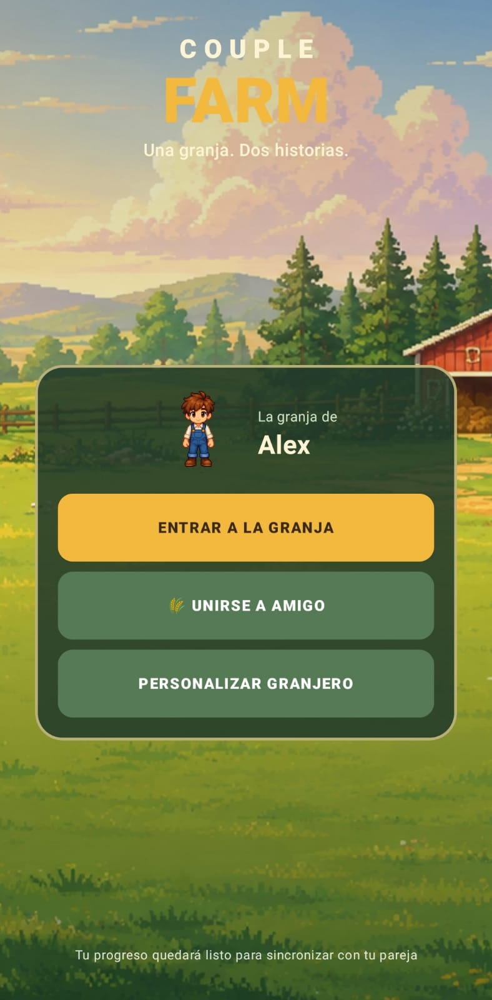
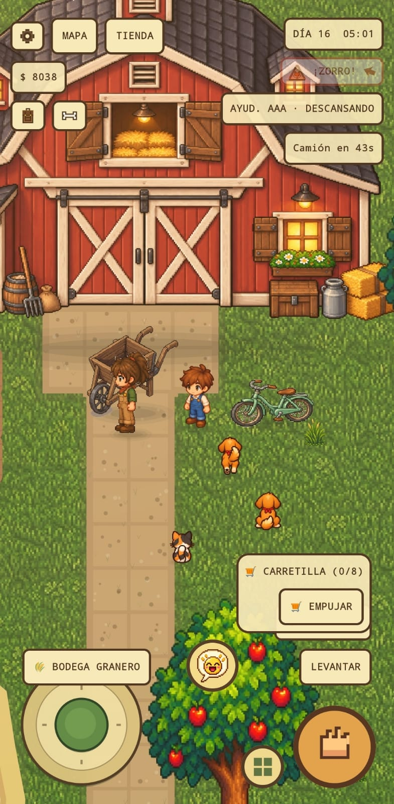
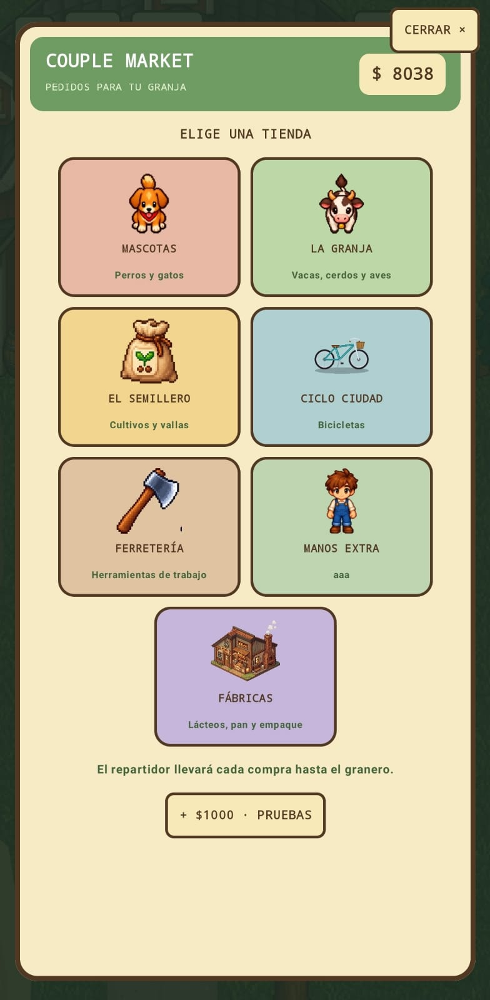
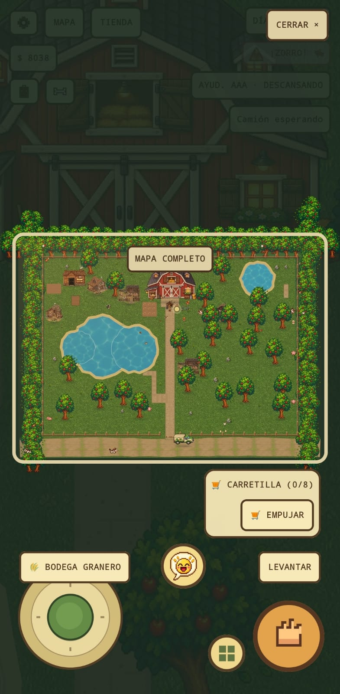
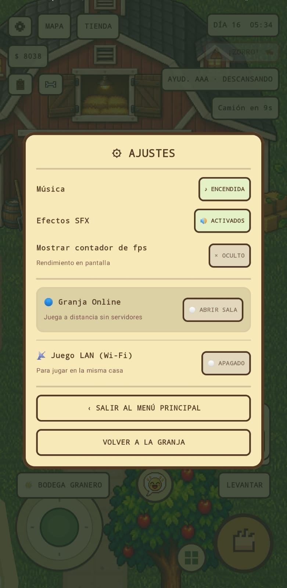
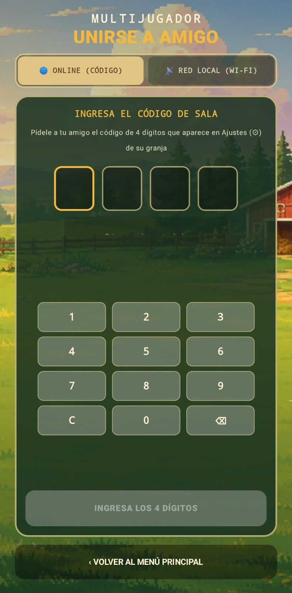

# CoupleFarm 🌱


Un videojuego de granja 2D para Android, construido desde cero con Kotlin y Jetpack Compose. CoupleFarm combina simulación persistente, pixel art, agricultura, animales con comportamiento propio y juego cooperativo para que dos personas puedan cuidar la misma granja incluso cuando no están conectadas al mismo tiempo.

> **Descarga directa:** instala la versión más reciente desde [GitHub Releases](https://github.com/Mangelbarboza/CoupleFarm/releases/latest).

## Lo más destacado

- Mundo 2D renderizado por capas, cámara con seguimiento, zoom y mapa completo.
- Ciclo agrícola con huertas sobre cuadrícula invisible, zanahoria y trigo, riego, crecimiento y cosecha.
- Gallinas, vacas, cerdos, perros y gatos con etapas de crecimiento, nombres y comportamientos autónomos.
- Mascotas que siguen órdenes, juegan con pelota e interactúan con aves, mariposas, zorros y agua.
- Herramientas, inventario visual, tienda, entregas con repartidor y economía de granja.
- Pesca, tala, minería, caminos, vallas, puertas y edificios de producción construibles.
- Granero, procesadora de lácteos, panadería, empaquetadoras y otras cadenas de producción.
- Guardado local completo del mundo y sesiones cooperativas por LAN/MQTT.
- Música dinámica, efectos por superficie y ambientación según la hora del día.
- Más de 400 recursos visuales y sonoros integrados.

## Arquitectura

| Área | Implementación |
| --- | --- |
| Interfaz | Jetpack Compose + Material 3 |
| Simulación | Motor determinista desacoplado de la UI |
| Renderizado | Canvas 2D por capas, orden por profundidad y sprites animados |
| Persistencia | Estado serializado con migración de partidas anteriores |
| Multijugador | Descubrimiento LAN, servidor/cliente local y salas MQTT |
| Audio | Gestor de música y efectos con controles independientes |
| Calidad | Pruebas unitarias del motor, persistencia y red; Android Lint en CI |

La lógica principal vive en `game/`, mientras que renderizado y controles están en `ui/game/`. Esta separación permite probar las mecánicas sin depender de una pantalla o dispositivo Android.

## Ejecutar el proyecto

1. Clona el repositorio.
2. Ábrelo con Android Studio.
3. Usa JDK 17 y sincroniza Gradle.
4. Ejecuta la configuración `app` en Android 7.0 (API 24) o superior.

También puedes compilar desde terminal:

```bash
./gradlew testDebugUnitTest lintDebug assembleDebug
```

La APK aparecerá en `app/build/outputs/apk/debug/app-debug.apk`.

## Personalización

La guía para incorporar música y nuevas razas de perros o gatos sin duplicar su comportamiento está en [docs/AGREGAR_MUSICA_Y_RAZAS.md](docs/AGREGAR_MUSICA_Y_RAZAS.md).

Para agregar música, coloca archivos `.ogg`, `.mp3` o `.wav` en `app/src/main/res/raw/` con un nombre que comience por `music_`; el juego los incorpora automáticamente a su lista de reproducción al recompilar.

## Estado

CoupleFarm está en desarrollo activo. La versión publicada es una build jugable de portafolio; las mecánicas, el balance y el multijugador continúan evolucionando.

---

Diseñado y desarrollado por **Ángel Barboza**.

## Galería

<p align="center">
  
  
  
</p>

<p align="center">
  
  
  
</p>
